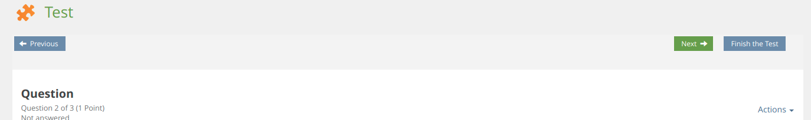

# SrMoveAssessmentToolbar ILIAS Plugin

Move assessment toolbar

This project is licensed under the GPL-3.0-only license

## Requirements

* ILIAS 6.0 - 7.999
* PHP >=7.2

## Installation

Start at your ILIAS root directory

```bash
mkdir -p Customizing/global/plugins/Services/UIComponent/UserInterfaceHook
cd Customizing/global/plugins/Services/UIComponent/UserInterfaceHook
git clone https://github.com/fluxfw/SrMoveAssessmentToolbar.git SrMoveAssessmentToolbar
```

Update, activate and config the plugin in the ILIAS Plugin Administration

## Description

Test:

